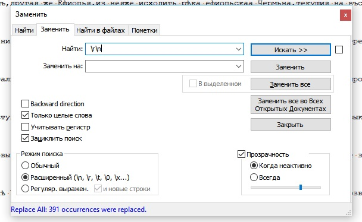
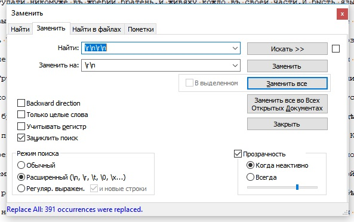
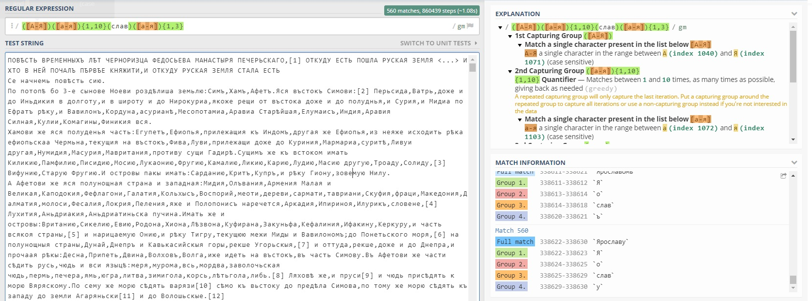

# Удалить все пустые строки
Для удаления пустых строк были использованы 2 регулярных выражения:

1)" \r\n" (В начале пробел) с заменой на ""

2)"\r\n\r\n" с заменой на "\r\n"

# Найти всех князей и города, имя и название которых оканчивается на "слав". В выдаче должны быть такие слова как "Ярославля, Ростиславъ, Ростиславу, Переяславлъ" и т.п. Но не должно быть "славу, выславше" и т.п. 

Для поиска используется регулярное выражение "([А-Я])([а-я]){1,10}(слав)([а-я]){1,3}", которое ищет по шаблону 1 большая буква + 1-10 любых букв + слав + 1-3 любых букв

Всего нашлось 560 совпадений